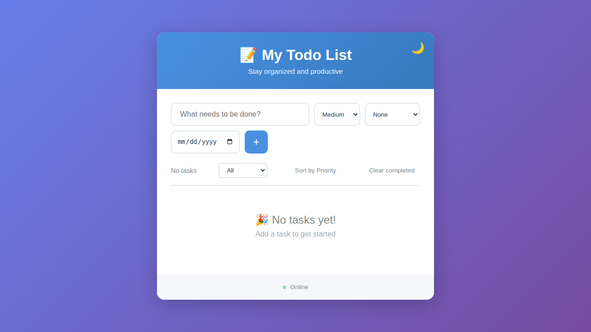
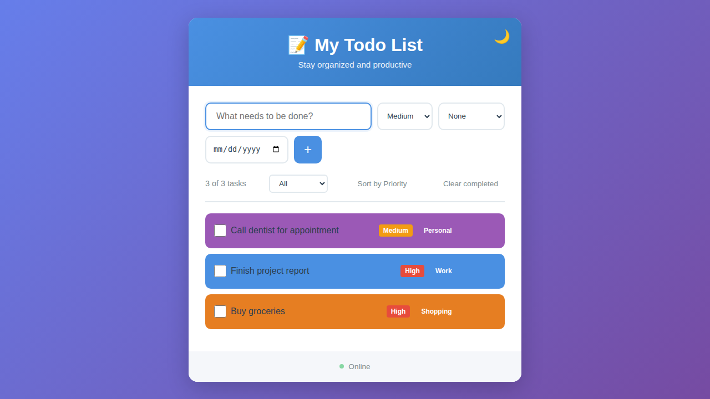
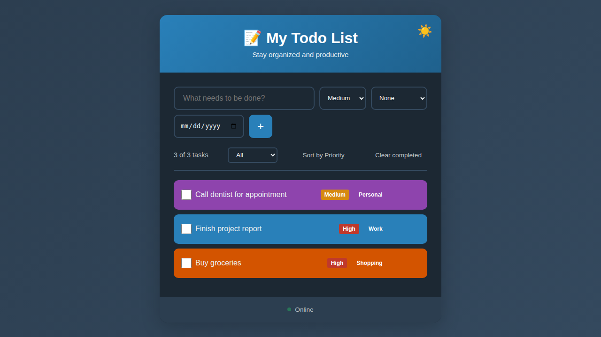

# Todo-PWA

A simple, elegant Progressive Web App (PWA) for managing your to-do list. Built with vanilla HTML, CSS, and JavaScript with full offline support.

## Features

✨ **Add and Manage Tasks** - Quickly add, complete, and delete tasks
📊 **Priority Levels** - Organize tasks by low, medium, or high priority
🏷️ **Categories** - Sort tasks into Work, Personal, Shopping, or custom categories
📅 **Due Dates** - Set due dates for your tasks to stay on track
🔁 **Recurring Tasks** - Create daily, weekly, or monthly recurring tasks
💾 **Persistent Storage** - Tasks are saved using IndexedDB with localStorage migration
📱 **Installable** - Install as a standalone app on any device
🔌 **Offline Support** - Works without an internet connection
🌙 **Dark Mode** - Toggle between light and dark themes
🎨 **Modern UI** - Clean, responsive design with smooth animations
🌐 **Cross-Platform** - Works on desktop and mobile devices
🧩 **Modular Architecture** - ES modules for maintainability and scalability

## Screenshots

### Light Mode

*Clean, minimal interface when starting fresh*


*Tasks organized by priority and category with color coding*

### Dark Mode

*Easy on the eyes with dark mode support*

## Getting Started

### Running Locally

1. Clone the repository:
```bash
git clone https://github.com/Suicynic/Todo-PWA.git
cd Todo-PWA
```

2. Serve the files using a local web server:
```bash
# Using Python
python -m http.server 8000

# Using Node.js (http-server)
npx http-server -p 8000
```

3. Open your browser and navigate to `http://localhost:8000`

### Installing as PWA

1. Open the app in a compatible browser (Chrome, Edge, Safari, etc.)
2. Click the install button in the address bar
3. The app will be installed and can be launched from your home screen or app menu

## Project Structure

```
Todo-PWA/
├── index.html        # Main HTML structure
├── styles.css        # Styling and animations
├── app.js           # Core application logic and TodoApp class
├── utils.js         # Helper functions (date, sort, theme utilities)
├── storage.js       # IndexedDB wrapper class for data persistence
├── sw.js            # Service worker for offline caching
├── manifest.json    # PWA manifest file
├── icon-192.png     # App icon (192x192)
└── icon-512.png     # App icon (512x512)
```

### Modular Architecture

The app uses ES modules for better code organization:

- **`app.js`** (295 lines) - TodoApp class with event listeners and render logic
- **`utils.js`** (119 lines) - Pure helper functions for date/sort/theme operations with fallbacks
- **`storage.js`** (61 lines) - IndexedDB wrapper with error handling and migration support

This modular structure improves:
- 🔧 **Maintainability** - Clear separation of concerns
- 🧪 **Testability** - Individual modules can be tested independently
- 📈 **Scalability** - Easy to add new features without increasing complexity
- 👥 **Collaboration** - Multiple developers can work on different modules

## Technologies Used

- **HTML5** - Semantic markup
- **CSS3** - Modern styling with flexbox, animations, and responsive design
- **JavaScript (ES6+)** - Vanilla JavaScript with ES modules for clean architecture
- **Service Workers** - For offline functionality and caching
- **IndexedDB API** - Async database for scalable data persistence (~1GB limit)
- **PWA Manifest** - For app installation and metadata
- **date-fns** - Date manipulation library (with fallback for offline scenarios)

## Browser Support

This PWA works on all modern browsers that support:
- Service Workers
- IndexedDB
- ES6+ JavaScript
- Web App Manifest

Tested on: Chrome, Firefox, Safari, Edge

## License

See [LICENSE](LICENSE) file for details.